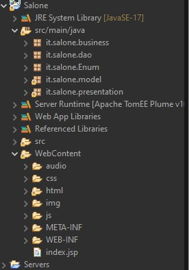
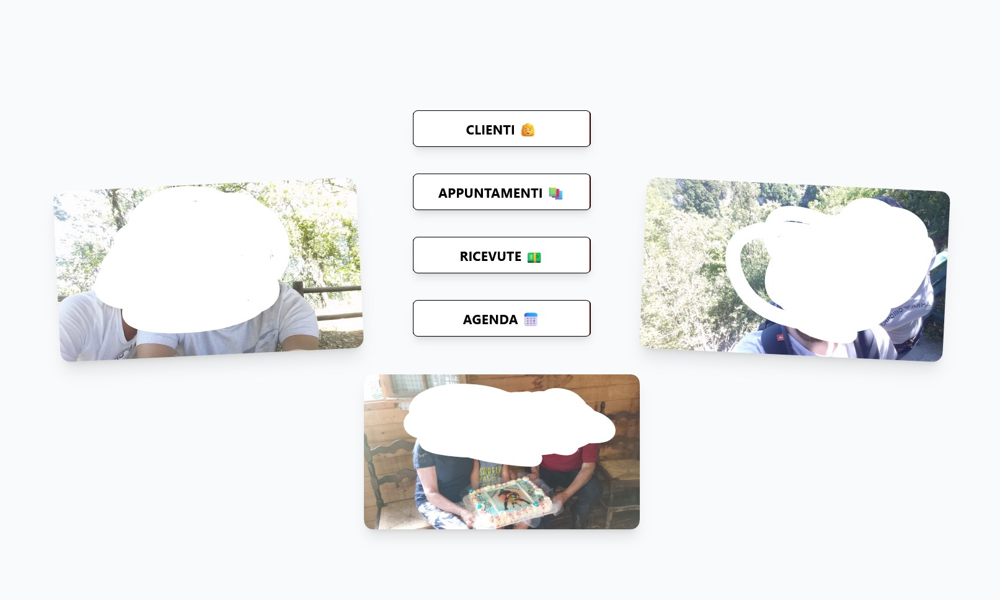
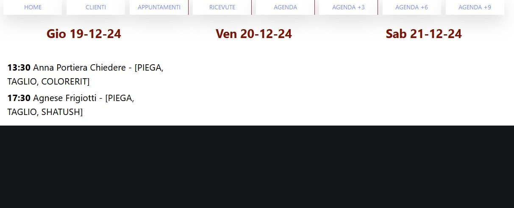
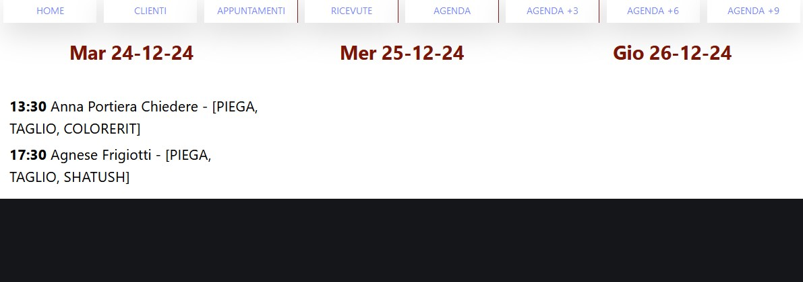
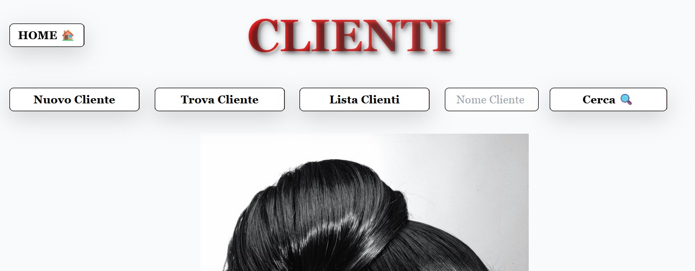
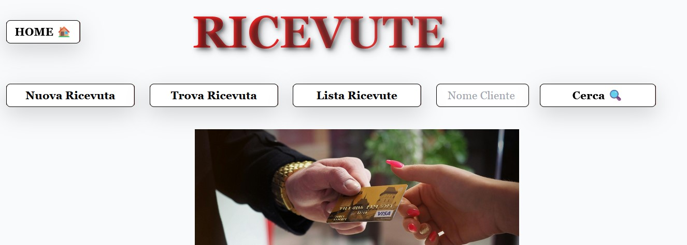
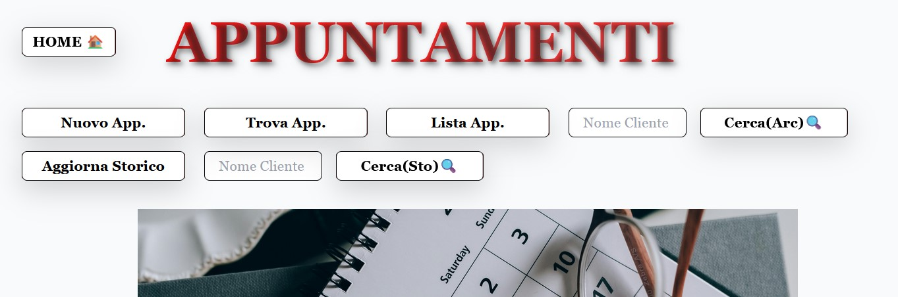

Web App per la gestione di attività commerciali (Salone di Bellezza)

Tecnologie utilizzate: Java EE, JPA (Entity Manager) con MySQL per la persistenza dei dati, EJB per la logica di business, JSP per la parte grafica.

Questa applicazione permette la gestione completa di un salone di bellezza con operazioni CRUD per Clienti, Appuntamenti e Ricevute. Le funzionalità principali includono:

    Visualizzazione degli appuntamenti del giorno a schermo.
    Generazione automatica delle ricevute direttamente dagli appuntamenti.
    Salvataggio degli appuntamenti in una tabella di storico per la gestione dei dati passati.

Il sistema è stato sviluppato durante il corso di Java, rappresentando il mio primo progetto reale e completamente funzionante. È stato aggiornato e migliorato più volte, incorporando i nuovi concetti appresi durante il corso, come la gestione della persistenza con JPA, la creazione di servizi EJB e la gestione delle interfacce con JSP.

struttura del progetto(Eclipse)

index

appuntamenti a schermo(3 giorni)

appuntamenti a schermo( +3 giorni)

sezione clienti

sezione ricevute

sezione appuntamenti

